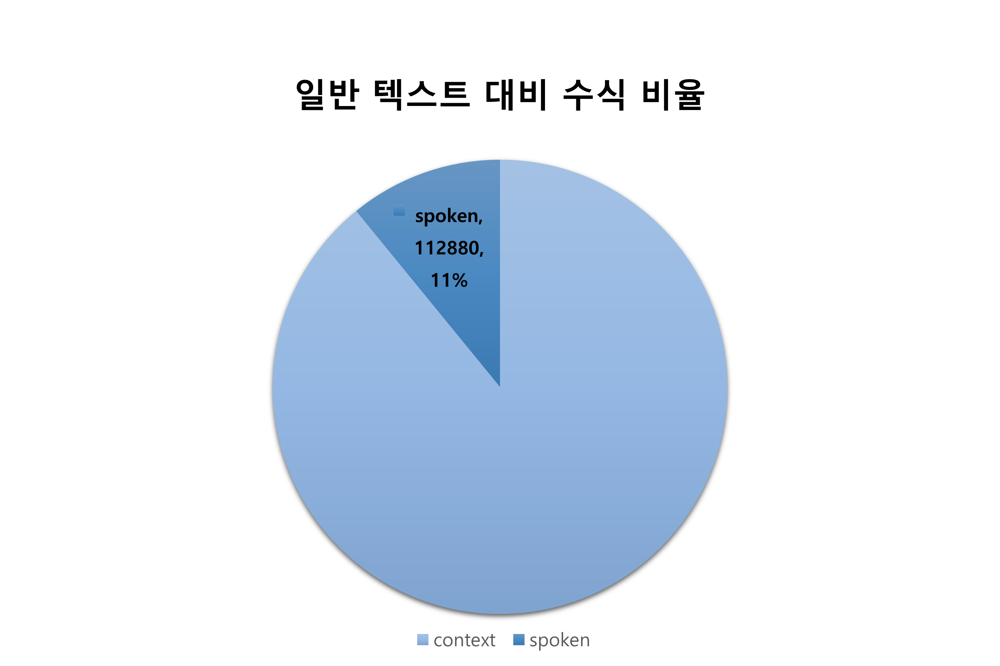

<meta charset="utf-8">
<meta name="viewport" content="width=device-width, initial-scale=1">
<title>MathBridge2 Test</title>

<link href="https://fonts.googleapis.com/css?family=Google+Sans|Noto+Sans|Castoro" rel="stylesheet">
<link rel="stylesheet" href="https://cdnjs.cloudflare.com/ajax/libs/font-awesome/5.15.3/css/all.min.css">

  <h1>MathBridge 2 (제목 수정 필요)</h1>
  
  

    <a href="#" style="font-size: 1.0rem; color: #209cee; text-decoration: none;">member1</a>1, 
    <a href="#" style="font-size: 1.0rem; color: #209cee; text-decoration: none;">member2</a>2, 
    <a href="#" style="font-size: 1.0rem; color: #209cee; text-decoration: none;">member3</a>2,
    <a href="#" style="font-size: 1.0rem; color: #209cee; text-decoration: none;">member4</a>1,2
  

  
  

    

      Seoul National University ....
    

  

  

    <a href="#" style="background: #333; color: white; padding: 10px 20px; border-radius: 30px; font-weight: bold;">📄 arXiv</a>
    <a href="#" style="background: #333; color: white; padding: 10px 20px; border-radius: 30px; font-weight: bold;">💻 Code</a>
    <a href="https://huggingface.co/datasets/delay1/MathBridge2/tree/main" style="background: #333; color: white; padding: 10px 20px; border-radius: 30px; font-weight: bold;">🤗 Dataset</a>
  

<h2>Abstract</h2>
  

    

      Converting spoken mathematical expressions into LaTeX is a critical yet under-addressed
problem: it requires translating ambiguous, conversational speech into a rigid symbolic language while
recovering precise structure such as nesting, operator precedence, and scope. As lecture capture and AI
assisted learning tools become ubiquitous, the inability to reliably convert spoken mathematics into editable,
searchable LaTeX has become a practical bottleneck for education and research—limiting high-quality
lecture transcription, accessible note-taking, and downstream reuse of mathematical content. Despite major
advances inautomatic speechrecognition (ASR)andlargelanguagemodels(LLMs),existingapproachesfor
mathematical ASR post-correction often depend on multiple transcripts, focus on isolated equations rather
than natural lecture utterances, and are evaluated on small, constrained test sets. These limitations leave the
real-world lecture settings—where speakers omit terms, reference symbols implicitly, and mix equations
with explanatory sentences—largely unseen. To close this gap, we release the first fully open-source, large
scale dataset of spokenmathematics:over30,000human-annotatedaudiosamplesfromrealEnglishlectures,
spanning diverse scientific domains and covering both equations and mathematical sentences. We also
introduce a practical conversion pipeline that pairs an ASR post-correction model with a formula-detecting
LLM to more accurately identify and render mathematical content in lecture speech. On our new S2L
Equationsbenchmark,ourmodelsoutperformMathSpeechbymorethanxx.xpercentagepoints,establishing
a strong baseline for speech-to-LaTeX conversion under realistic lecture conditions.
    

  

  <h2>Key Takeaways</h2>
   내용 추가

  <h2>Results</h2>
   내용 추가 

  <h2>Statistics</h2>

  

    
    <h3 style="border-left: 6px solid #209cee; padding-left: 15px;">1. Overview</h3>
    

      <strong>• Total Samples (총 문장 수):</strong> 31,336 개
    

    <h3 style="border-left: 6px solid #209cee; padding-left: 15px; margin-top: 50px;">2. Distribution of Subjects</h3>
    
    

      

        
        
Figure 1. Subject Distribution

      

      

        <table style="width: 100%; border-collapse: collapse; text-align: center; font-size: 1.1rem; box-shadow: 0 2px 8px rgba(0,0,0,0.05);">
          <thead style="background-color: #f8f9fa; border-bottom: 2px solid #eee;">
            <tr><th style="padding: 15px; border:1px solid #ddd;">Field</th><th style="padding: 15px; border:1px solid #ddd;">Count</th></tr>
          </thead>
          <tbody>
            <tr><td style="padding: 12px; border:1px solid #ddd;">Calculus</td><td style="padding: 12px; border:1px solid #ddd;">338</td></tr>
            <tr><td style="padding: 12px; border:1px solid #ddd;">Algebra</td><td style="padding: 12px; border:1px solid #ddd;">218</td></tr>
            <tr><td style="padding: 12px; border:1px solid #ddd;">Linear Algebra</td><td style="padding: 12px; border:1px solid #ddd;">9</td></tr>
            <tr><td style="padding: 12px; border:1px solid #ddd;">Geometry</td><td style="padding: 12px; border:1px solid #ddd;">3</td></tr>
            <tr><td style="padding: 12px; border:1px solid #ddd;">Economics</td><td style="padding: 12px; border:1px solid #ddd;">2</td></tr>
            <tr><td style="padding: 12px; border:1px solid #ddd;">Statistics</td><td style="padding: 12px; border:1px solid #ddd;">2</td></tr>
            <tr><td style="padding: 12px; border:1px solid #ddd;">Analysis</td><td style="padding: 12px; border:1px solid #ddd;">6</td></tr>
          </tbody>
        </table>
      

    

    <h3 style="border-left: 6px solid #209cee; padding-left: 15px; margin-top: 60px;">3. Math Formula Ratio</h3>
    
    

      

        
        
Figure 2. Formula Ratio Analysis

      

      

        <table style="width: 100%; border-collapse: collapse; text-align: center; font-size: 1.1rem; box-shadow: 0 2px 8px rgba(0,0,0,0.05);">
          <thead style="background-color: #f8f9fa; border-bottom: 2px solid #eee;">
            <tr><th style="padding: 15px; border:1px solid #ddd;">Metric</th><th style="padding: 15px; border:1px solid #ddd;">Value</th></tr>
          </thead>
          <tbody>
            <tr><td style="padding: 12px; border:1px solid #ddd; text-align: left;">Total words</td><td style="padding: 12px; border:1px solid #ddd;">1,035,321</td></tr>
            <tr><td style="padding: 12px; border:1px solid #ddd; text-align: left;">Formula words</td><td style="padding: 12px; border:1px solid #ddd;">112,880</td></tr>
            <tr><td style="padding: 12px; border:1px solid #ddd; font-weight: bold; color: #107bbd;">Ratio</td><td style="padding: 12px; border:1px solid #ddd; font-weight: bold; color: #107bbd;">10.90%</td></tr>
          </tbody>
        </table>
      

    

    <h3 style="border-left: 6px solid #209cee; padding-left: 15px; margin-top: 60px;">4. Text Length & Diversity</h3>
    

      <table style="width: 100%; border-collapse: collapse; text-align: center; font-size: 1.0rem; box-shadow: 0 2px 8px rgba(0,0,0,0.05);">
        <thead style="background-color: #f8f9fa; border-bottom: 2px solid #eee;">
          <tr><th style="padding: 15px; border:1px solid #ddd;">Metric</th><th style="padding: 15px; border:1px solid #ddd;">Count</th></tr>
        </thead>
        <tbody>
          <tr><td style="padding: 12px; border:1px solid #ddd;">Total Tokens</td><td style="padding: 12px; border:1px solid #ddd;">4,545,332</td></tr>
          <tr><td style="padding: 12px; border:1px solid #ddd;">Avg Tokens/Line</td><td style="padding: 12px; border:1px solid #ddd;">145.08</td></tr>
        </tbody>
      </table>
    

  

  <h2>Citation</h2>
   내용 추가 

